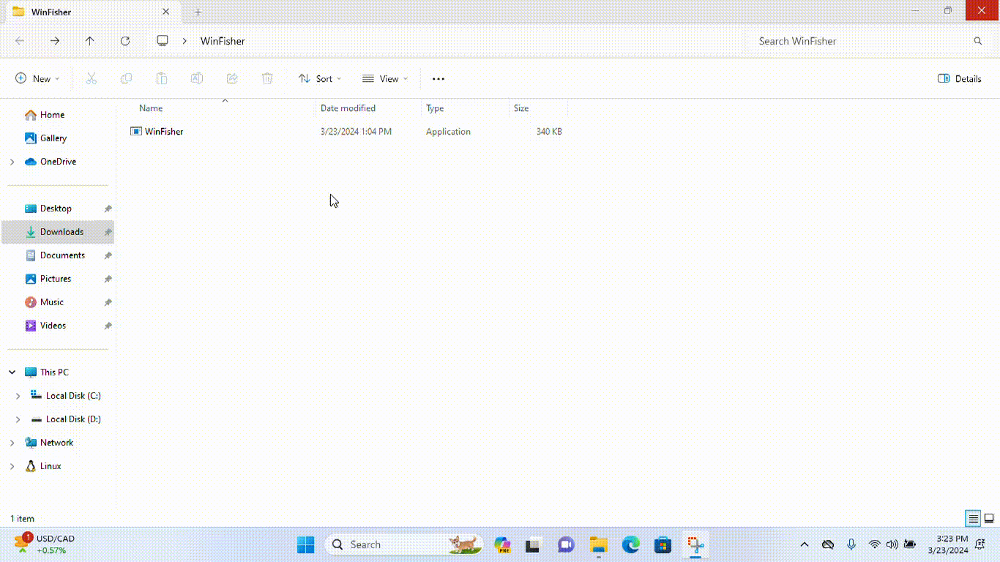

<h3>WinFisher</h3>

Fake Window 10 Login Screen For Fishing

<!-- TABLE OF CONTENTS -->

  
Table of Contents

  <ol>
    <li>
      <a href="#about-the-project">About The Project</a>
      <ul>
        <li><a href="#background">Background</a></li>
        <li><a href="#built-with">Built With</a></li>
      </ul>
    </li>
    <li>
      <a href="#getting-started">Getting Started</a>
      <ul>
        <li><a href="#prerequisites">Prerequisites</a></li>
        <li><a href="#compiling">Compiling</a></li>
        <li><a href="#note">Note</a></li>
      </ul>
    </li>
    <li><a href="#license">License</a></li>
    <li><a href="#contact">Contact</a></li>
    <li><a href="#screen-shots">Screen Shots</a></li>
  </ol>

## About The Project

### What Is It

This project presents a deceptive tool, a fake Windows 10 login screen, that enables attackers to display a counterfeit login interface on a victim's device. Its primary purpose is to gather login credentials from unsuspecting users. While its application is limited, certain scenarios, like the one discussed below, may necessitate its use.

### Background and UseCase Scenario

During my 3rd semesters at university, I discovered a vulnerability within our institution's web portal. Upon reporting it to the Head of Department and Vice Chancellor, I was granted permission to conduct penetration testing across all university systems.

Our university relies on MS Active Directory for authentication, with both faculty and students possessing distinct AD accounts. In lecture rooms, faculty members typically log into designated systems to access the web portal for managing attendance, quizzes, assignments, and results. Students are restricted from using these systems, except for occasions where they need to demonstrate projects or give presentations. In such cases, teachers often leave their accounts logged in and allow students to use them.

To exploit this scenario, I developed this application, designed to harvest teacher credentials, granting access to their web portals. After obtaining these credentials, This application just stores the credential in current directory but my variant o either uploaded creds to a publicly accessible smb share (accessible by both faculty and students), or stored them in a Firebase database. Moreover, my variant used different techniques for persistence and scheduling to evade detection.

During presentations, I discreetly installed this application on teacher systems, subsequently gaining access to their portals.

This project underscores the importance of cybersecurity awareness and the need for robust measures to safeguard against malicious attempts.

### Built With

 

## Getting Started

### Prerequisites

* Windows
* Visual Studio
* Window Presentation Foundation

### Compiling

1. Clone the repo
2. Open 'WinFisher.sln' in visual studio
3. Change mode to Release Mode because Debug mode does not block window hot keys
4. Build solution 

### Active Directory Environment
make following changes according to your target

Normal Account / Local Account:

AD Account / Domain Account: 

### Note

1. When compiled in DEBUG mode, window hotkeys are not disabled
2. When compiled in Release mode, window hotkeys i.e Win Key, Alt+Tab, Alt+F4 etc are disabled 

## License

Distributed under the MIT License. See `LICENSE` for more information.

## Contact

